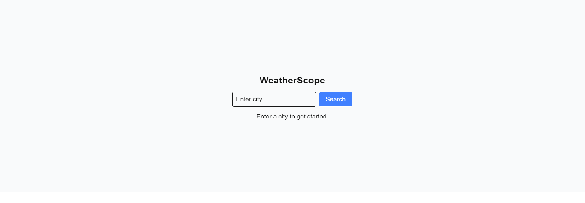

# WeatherScope 🌤️


WeatherScope هو تطبيق ويب لعرض الطقس الحالي لأي مدينة حول العالم باستخدام **Next.js 13 + TypeScript + React + Tailwind CSS**.  
يدعم التطبيق **البحث عن المدن بالإنجليزية** ويعرض الطقس مع أيقونة وحالة الرطوبة، ويتميز أيضًا بدعم **Dark Mode**.

---

## المميزات

- البحث عن الطقس لأي مدينة بالإنجليزية.
- عرض درجة الحرارة الحالية، وصف الطقس، والرطوبة.
- **Dark Mode** تلقائي حسب وضع النظام.
- **Spinner** أثناء تحميل البيانات.
- **Responsive**: يعمل على جميع الشاشات.
- دعم **Geolocation** لعرض الطقس لموقعك الحالي تلقائيًا.

---

## التقنيات المستخدمة

- [Next.js 13](https://nextjs.org/) (App Router)  
- [React](https://reactjs.org/) + TypeScript  
- [Tailwind CSS](https://tailwindcss.com/)  
- OpenWeather API ([OpenWeather](https://openweathermap.org/api))  

---

## طريقة التشغيل

1. استنساخ المشروع:

```bash
git clone https://github.com/YOUR_USERNAME/weather-scope.git
cd weather-scope
